# UI Result Panel Audit

Date: 2026-03-21

## Scope

- Review the current local UI layout with screenshot evidence.
- Decide whether the home screen still needs structural optimization.
- Land only small, high-frequency improvements with direct UX impact.

## Environment

- UI URL: `http://127.0.0.1:3030/`
- Capture tools: local Chrome headless and Playwright full-page screenshots
- Note: the named `web-ui-screenshot-audit` skill was not available in this session, so the audit used the live local UI plus saved screenshots instead.

## Automated Verification

- `node --test scripts/ai/__tests__/ui_index.test.js scripts/ai/__tests__/ui_server.test.js scripts/ai/__tests__/inbox_sync.test.js scripts/ai/__tests__/inbox_pushbullet.test.js scripts/ai/__tests__/ui_inbox_flow.test.js`
- `node --test scripts/ai/__tests__/ui_index.test.js scripts/ai/__tests__/ui_markup.test.js scripts/ai/__tests__/ui_inbox_flow.test.js`
- `npm test`

## Screenshot Evidence

### Before

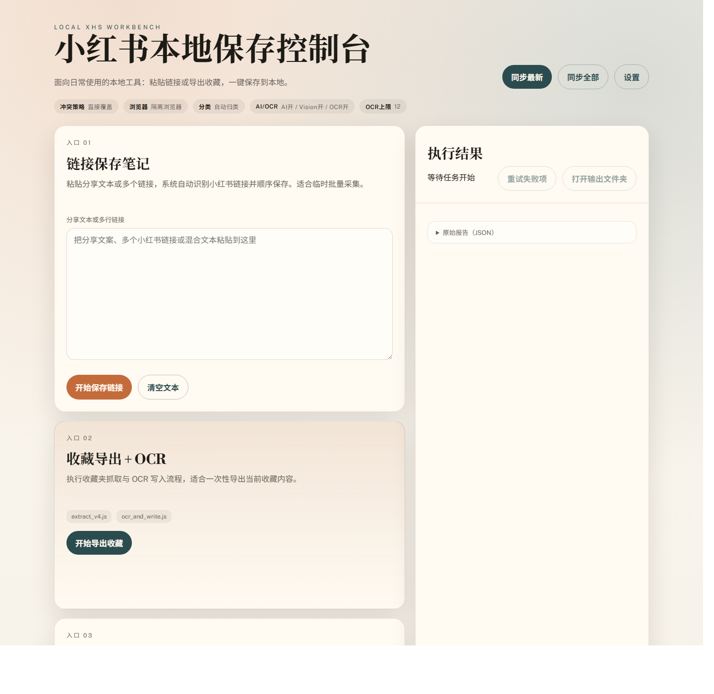

### After

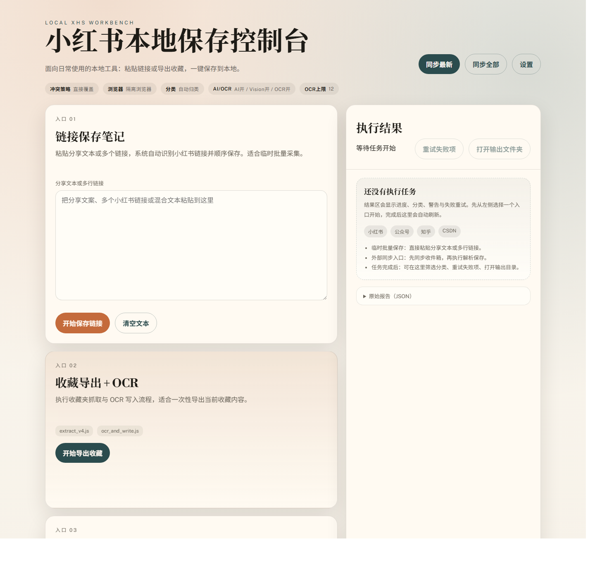

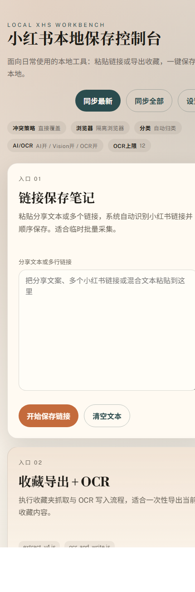

### Second Iteration

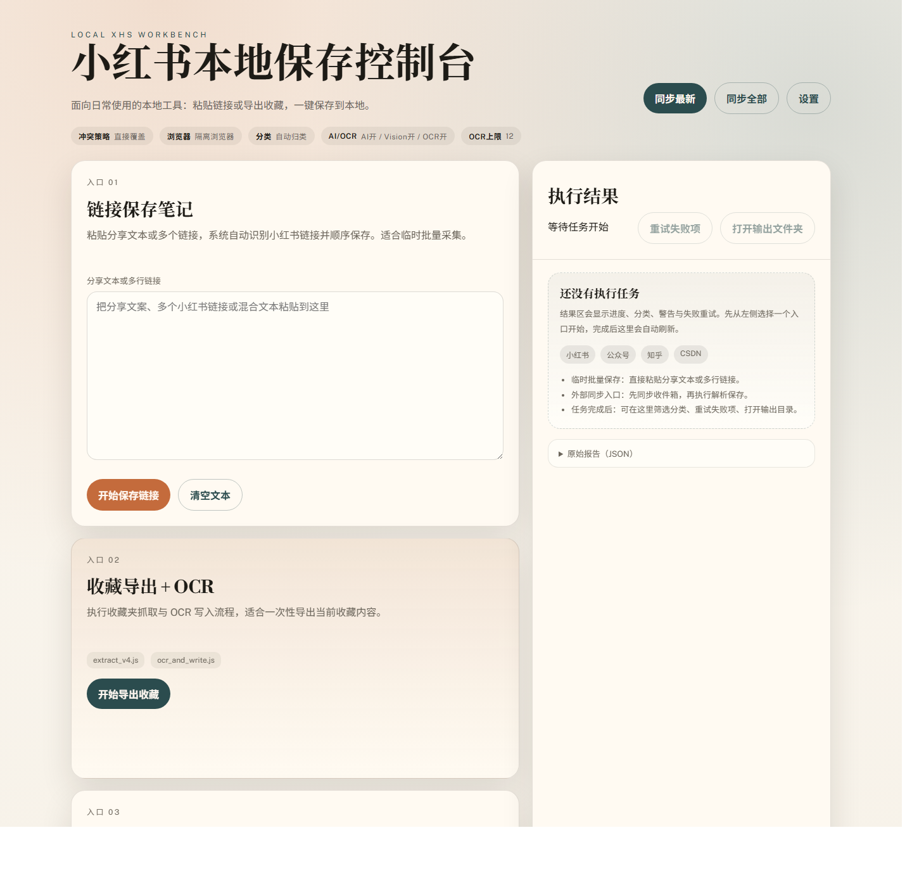

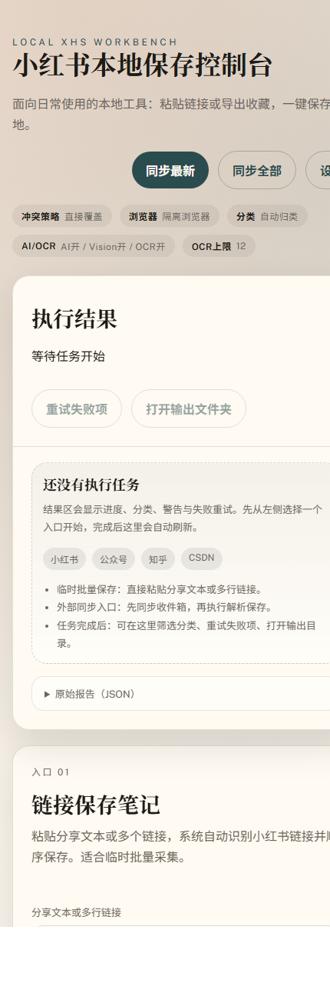

### Third Iteration

These screenshots use the real `ui/app.js` and `ui/styles.css` with local mocked result data so the grouped action header is visible in a stable preview state.

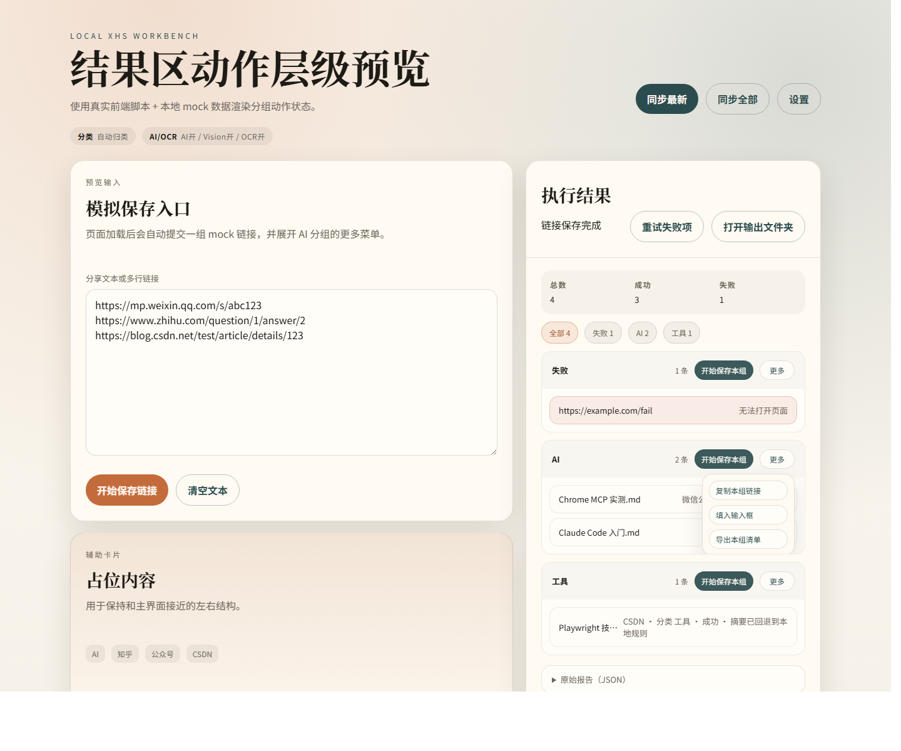

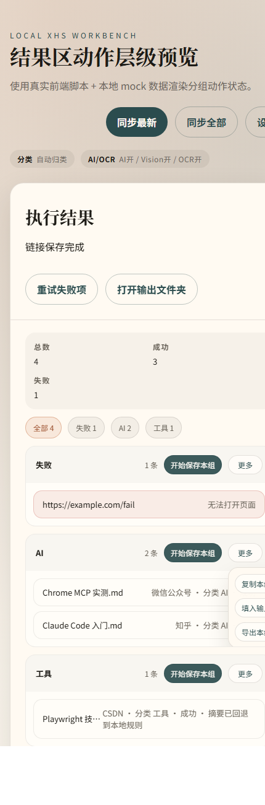

### Fourth Iteration

These screenshots keep using the real `ui/app.js` and `ui/styles.css` with local mocked result data, but switch the result area into the warning-focused filter so the warning badge and reduced scanning path are directly visible.

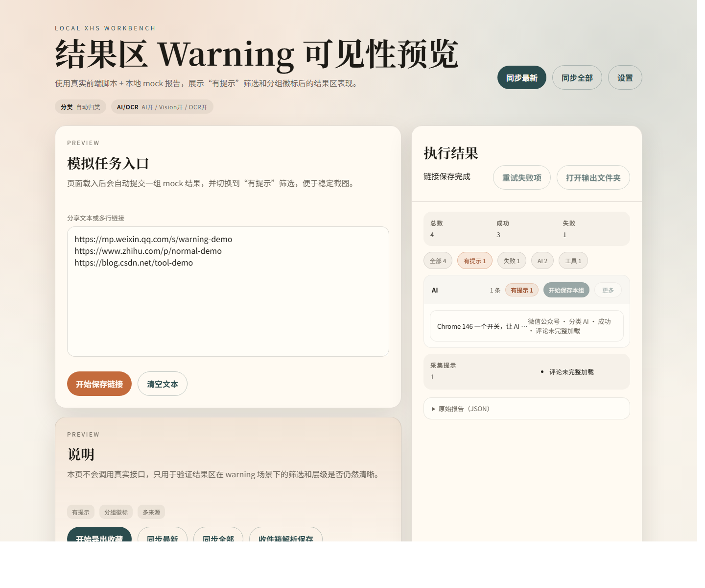

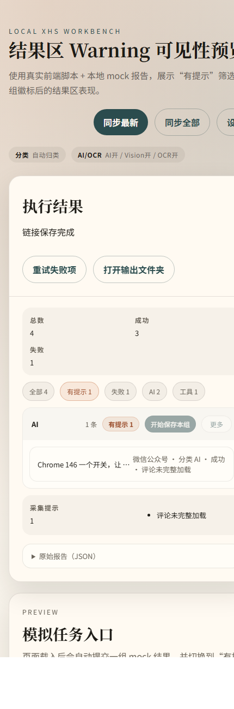

### Fifth Iteration

These screenshots return to the live home screen after consolidating the external inbox actions into Entry 03, adding the recent `10 / 20 / 30` range selector, and removing the stretched desktop result card height.

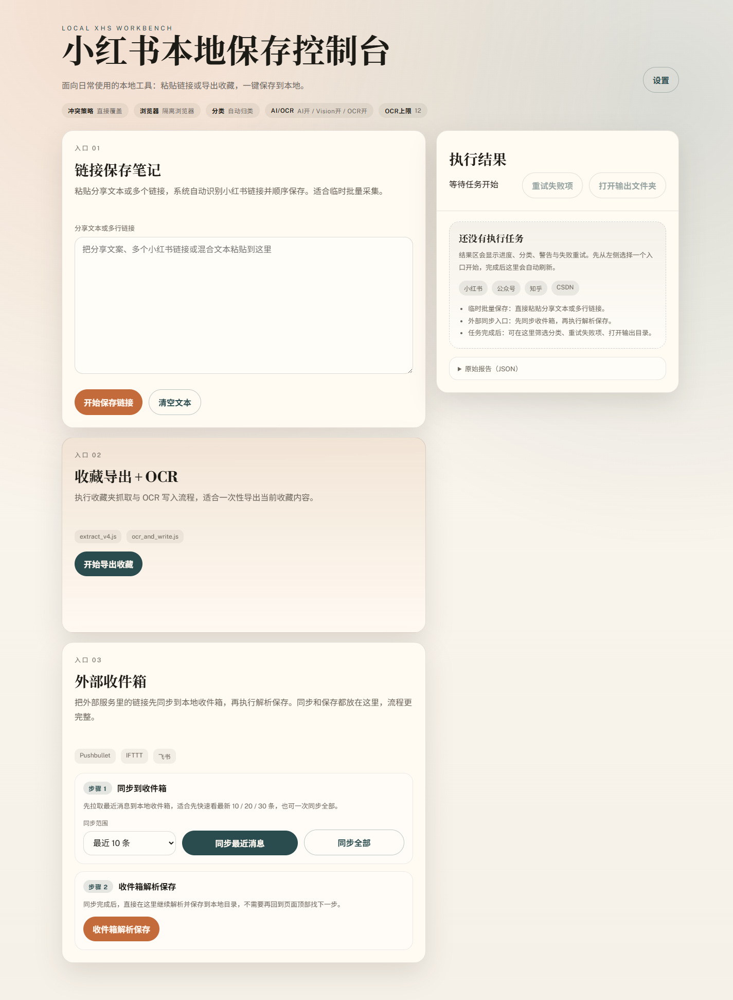

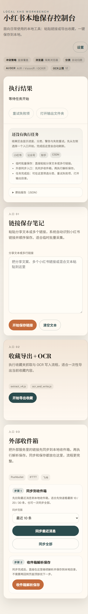

## Findings

### P1: Desktop result panel originally looked unfinished on first load

Before the early UI passes, the right-side result card showed only the title, disabled actions, and the raw JSON toggle. On desktop, that created a strong placeholder impression and wasted the main feedback surface.

### P2: Mobile originally prioritized input over feedback

That issue was addressed by rendering the result card before the entry stack on small screens, so task feedback appears in the first screen instead of after the forms.

### P3: Dense group actions created scanning friction

That issue was reduced by keeping the primary action visible and moving secondary actions behind a compact menu.

### P4: Warning-bearing rows were still easy to miss

That issue was reduced by adding a warning-focused result filter and a warning badge on affected groups.

### P5: Inbox sync and inbox save were previously split across different areas

That flow problem is now addressed. The live screenshots show the inbox sync actions and the inbox save action grouped together inside Entry 03, with a visible Step 1 / Step 2 structure and a recent-range selector beside the sync action.

### P6: Desktop idle layout still had unnecessary empty vertical space

After the inbox flow cleanup, the next visible friction was the right result panel stretching to match the full left column height. That idle-state blank area is now reduced by letting the result card size to its content on desktop.

## Changes Landed

First pass:

- add a persistent empty state inside the result area
- explain what appears after execution
- show supported content sources
- remind the user what they can do next

Second pass:

- on screens `980px` and below, render the result card before the entry stack
- tighten the mobile idle-state footprint so feedback appears earlier

Third pass:

- keep the primary group action visible
- move copy/fill/export into a compact more menu
- close secondary menus when another menu opens or when the user clicks away

Fourth pass:

- add a warning-focused result filter
- add a compact warning badge to affected groups
- when the warning filter is active, only show the rows that still need attention

Fifth pass:

- remove the duplicated top-level inbox sync entry from the home screen flow
- keep inbox sync and inbox save together inside Entry 03 as a two-step workflow
- add a recent sync selector for `10`, `20`, and `30` messages
- keep full sync available as a secondary action in the same section
- let the desktop result card size to content instead of stretching to the full column height
- add a lightweight favicon declaration so audit runs do not depend on a missing local icon file

## Recommendation

Current answer to "should we keep optimizing": yes, but only incrementally.

Recommended order:

1. Keep the consolidated Entry 03 workflow and recent-range selector.
2. Keep the warning filter and warning badge design.
3. Keep the desktop result card content-sized on idle screens.
4. Limit future work to minor polish such as clearer disabled-state helper text or autocomplete hints in settings.
5. There is no need right now for another structural home-screen refactor.
