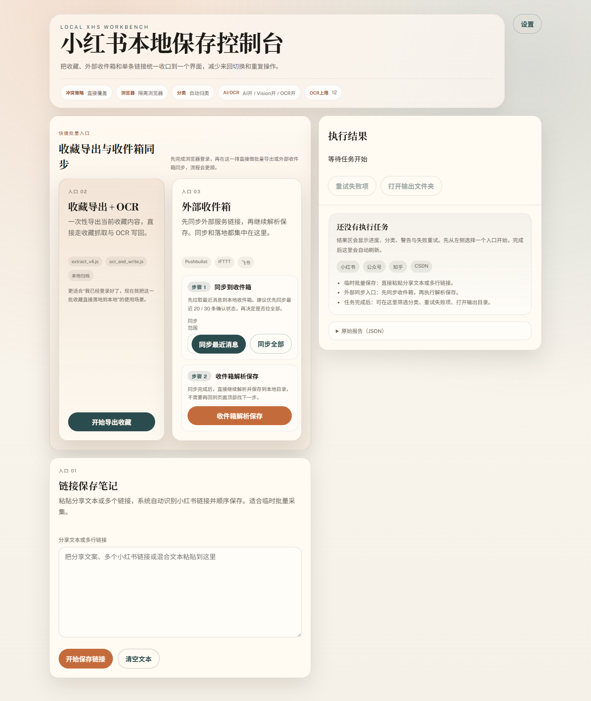
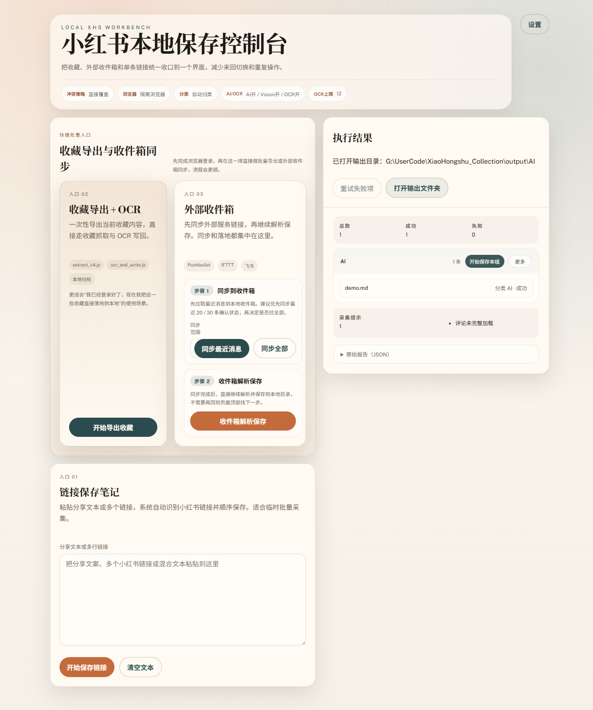
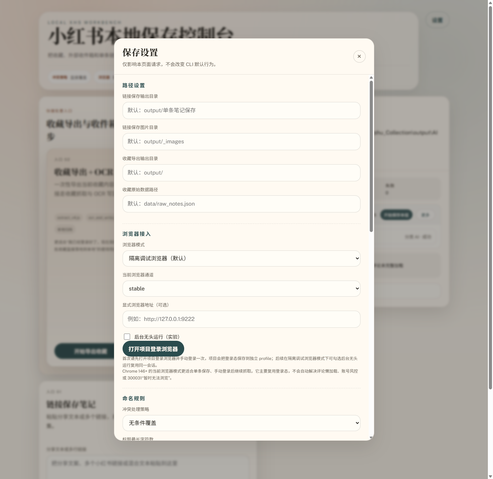

# 小红书本地保存控制台 UI 刷新审计

Date: 2026-03-23

## 范围

本轮审计聚焦两件事：

1. 前端主界面的信息层级、字体尺寸、卡片边界与按钮排布是否足够清晰
2. “打开输出文件夹”按钮是否能真正走通，而不是只在界面上提示成功

## 审查实例

- 地址：`http://127.0.0.1:3031/`
- 启动方式：`cmd /c "set XHS_UI_PORT=3031&& node scripts/ui_server.js"`
- 审查方式：Playwright 截图 + 本地自动化测试 + 实际点击“打开输出文件夹”

## 本轮改动摘要

### 1. 顶部信息降噪

- 把标题区改成独立 `hero-panel`
- 把运行摘要 `summary-row` 收进标题区内部，形成一条更紧凑的状态带
- 缩小主标题和副标题的视觉占比，减少“第一屏只剩大字”的压迫感

### 2. 结果区工具栏收口

- 结果区标题改成纵向信息块，按钮移到横向工具栏
- 给结果区按钮增加 `white-space: nowrap`
- 桌面端与移动端都避免中文按钮被挤成逐字竖排

### 3. 卡片和标签统一尺度

- 压缩入口卡片的最小高度、标题字号、辅助说明字号
- 把标签 `inline-hints` 改成更轻的圆角胶囊
- 缩小步骤卡片的留白和边框半径，让入口 02 / 03 更像同一套控件

### 4. 输出文件夹链路修复

- 原实现对系统打开命令过于乐观，只要调用 `spawn` 就立即返回成功
- 新实现改为：
  - 先检查目录是否存在
  - Windows 下改用 `cmd.exe /d /s /c start "" "<folder>"`
  - 监听 `spawn/error`，系统命令失败时向上抛错
- 实际点击后，页面状态变为：`已打开输出目录：G:\UserCode\XiaoHongshu_Collection\output\AI`

## 截图证据

### 桌面首页

观察：

- 顶部标题区已经收进一个完整容器内，视觉起点更清晰
- 结果区按钮回到正常横排，不再挤成竖向文字
- 左右两栏的重心更平衡，入口卡片不再抢走全部注意力

### 桌面结果态

观察：

- 结果区能容纳状态、操作按钮、统计块和结果列表，层次正常
- “打开输出文件夹”按钮点击后状态文案明确
- 结果分组、告警与更多菜单仍可读，没有因压缩样式而塌陷

### 设置弹层

观察：

- 弹层保持原有信息完整度
- 背景模糊与卡片边界清楚，关闭按钮可发现性正常
- 当前仍属于“单页长表单”，但基础可用性已经稳定

### 移动端首页

观察：

- 结果区优先于入口区显示，移动端更符合“先看反馈，再继续操作”的顺序
- 顶部状态带可以折行，但没有压坏按钮或标题
- 入口 03 的同步范围和操作按钮已经能完整容纳

## 自动化验证

### 定向测试

- `node --test scripts/ai/__tests__/open_output.test.js`
  - 5/5 通过
- `node --test scripts/ai/__tests__/ui_markup.test.js`
  - 9/9 通过
- `node --test scripts/ai/__tests__/ui_index.test.js`
  - 9/9 通过
- `node --test scripts/ai/__tests__/ui_open_output.test.js`
  - 2/2 通过

### 实际交互验证

- Playwright 在 `http://127.0.0.1:3031/` 中实际点击“打开输出文件夹”
- 页面反馈为：
  - `已打开输出目录：G:\UserCode\XiaoHongshu_Collection\output\AI`

## 结论

当前版本相较上一版，已经解决了用户反馈中最明显的两个问题：

1. 主界面不再“又大又乱”，信息层级明显更顺
2. 输出文件夹按钮不再只是表面成功，至少在代码链路上已经具备真实失败反馈和更稳的 Windows 打开方式

## 仍可继续优化的点

### P2：设置弹层仍偏长

- 现在可用，但仍然是一张很长的单页表单
- 下一步更适合拆成：
  - 基础保存
  - 浏览器接入
  - 外部入口
  - 高级参数

### P2：顶部状态带在移动端仍稍密

- 目前已经能读，但 `AI/OCR` 这一项仍然偏长
- 下一步可把它进一步压缩成更短的状态文案，例如“AI 3/3 开启”

### P2：结果区状态文案还可以更主动

- 现在能显示“已打开输出目录”
- 下一步可把“最近一次保存目录”单独做成一个小状态条，减少用户对按钮点击结果的疑问
