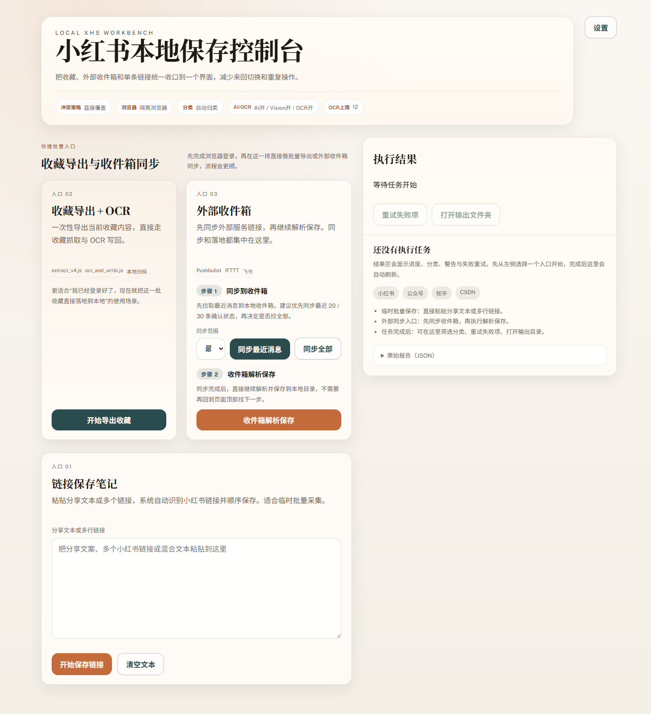
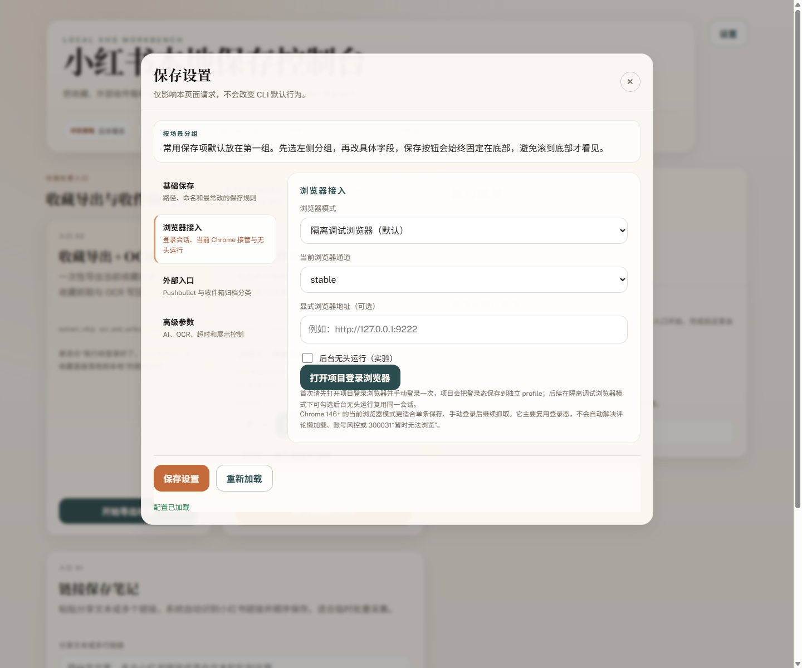
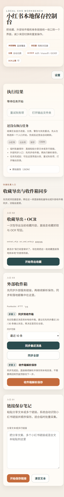

# 2026-03-24 首页视觉减法审计

## 目标

针对“界面还是太丑，方框还是堆在一起”的反馈，单独做一轮纯视觉减法，不改接口、不改交互流程，只处理层级过厚的问题。

## 处理范围

- 首页主区域
- 收件箱步骤区
- 结果区空状态
- 设置弹层视觉层级

## 调整策略

1. 去掉快捷入口外层大壳，保留真正需要点击的主卡片
2. 把收件箱步骤从“卡片套卡片”改成分段内容
3. 把结果区空状态从大虚线框改成普通说明区
4. 把设置区页签从厚重按钮改成更轻的导航项

## 验证

```bash
npm test
```

结果：`352/352` 通过。

## 截图

1. 首页桌面态  
   

2. 设置弹层桌面态  
   

3. 首页移动端  
   

## 结论

这一轮已经把“堆框感”明显压下来了：

- 首页从“外层盒子包两个内层盒子”改成更像工作台的分区
- 收件箱步骤区不再被双重边框包裹
- 结果区空状态更轻，不再抢视觉注意力
- 设置弹层导航变轻，右侧内容变成主视觉

如果继续做下一轮，建议优先：

1. 收紧首页 hero 高度，让首屏再短一些
2. 把结果区的操作按钮改成主次更分明的一主一次
3. 给移动端再单独做一轮字重和留白微调
