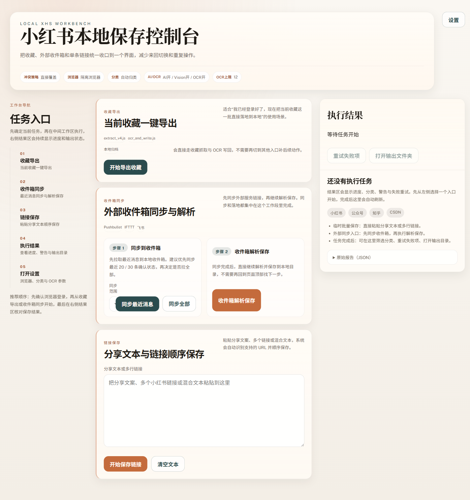
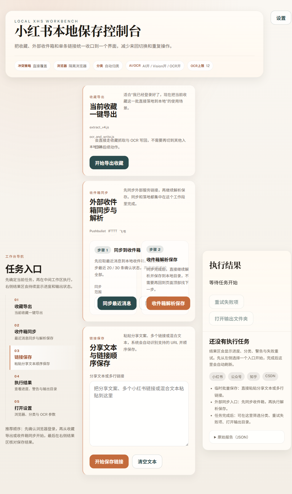
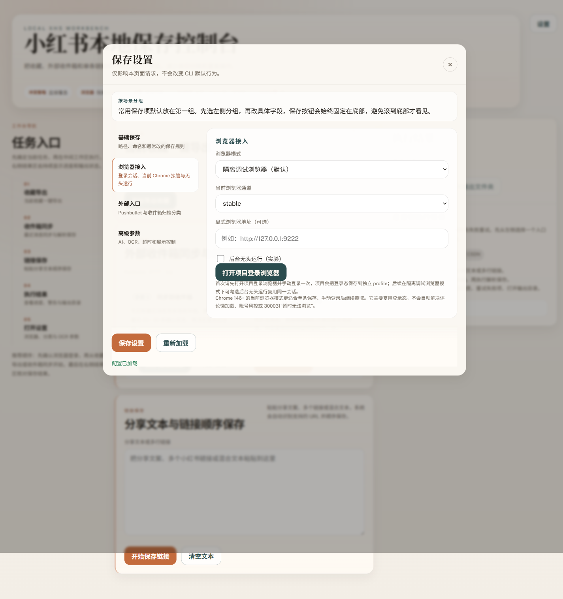

# 左导航工作台版 UI 审计

- 日期：2026-03-24
- 审查对象：`ui/index.html`、`ui/styles.css`、`ui/app.js`
- 审查实例：`http://127.0.0.1:3031/`
- 启动方式：`XHS_UI_PORT=3031 node scripts/ui_server.js`
- 审查方式：真实页面截图 + 自动化测试 + 样式微调后二次复拍

## 背景

本轮目标不是继续修卡片细节，而是把首页真正收口成“左导航工作台”。

初版左导航骨架虽然已经合入，但真实截图显示中间工作区仍然残留明显卡片感：

1. 中间三个主入口标题过大，桌面端断行重，视觉中心不稳定。
2. 左侧导航更像一组小卡片，不像持续可依赖的侧栏。
3. 收件箱同步步骤虽然逻辑上集中在同一区块，但视觉上仍偏“表单堆叠”。
4. Windows 打开输出目录仍走 `cmd.exe start`，用户侧“点了像没反应”的感知风险较高。

## 本轮调整

### 1. 左侧导航真正侧栏化

- 去掉厚重卡片边框，改成细竖线 + 条目高亮。
- 保留编号和说明，但弱化装饰感，让导航更接近工作台目录。
- 收紧侧栏间距，避免左侧抢主视觉。

### 2. 中间工作区压实成操作面板

- 放大中间列宽，缩小右侧结果列占比。
- 将区块标题改成更稳的无衬线大标题，减少夸张断行。
- 区块改成更平的面板样式，保留轻阴影和左侧强调线，不再堆大圆角卡片。
- 收件箱步骤改成桌面端双列步骤面板，减少纵向拖拽感。

### 3. 结果区保留，但不抢主入口

- 结果区继续固定在右侧，方便任务进行中查看。
- 维持移动端结果区优先的策略，但桌面端通过缩列降低压迫感。

### 4. 打开输出目录方式改稳

- Windows 从 `cmd.exe start` 改为直接调用 `explorer.exe <folder>`。
- 这条路径更接近用户手工打开目录的系统行为，降低“按钮没弹出”的概率。

### 5. 补上工作台级反馈

- 左侧导航增加当前分区高亮，不再只是静态锚点列表。
- 页面启用平滑滚动，分区跳转更像工作台内部定位。
- 如果“打开输出文件夹”失败，前端会自动推断输出路径并尝试复制到剪贴板，避免用户只有一句失败提示。

## 截图证据

### 初版桌面首页


观察：

- 左导航已出现，但条目仍像独立卡片。
- 中间标题断行过重，阅读节奏被频繁打断。

### 二次优化后的桌面首页



观察：

- 左侧导航更像连续侧栏。
- 中间三个主入口的操作关系更清楚，收件箱“双步骤”也更像流程面板。
- 右侧结果区仍然清晰，但不再压过中间执行区。

### 当前分区高亮后的桌面首页



观察：

- 当前分区高亮已经可见，用户能明确知道自己正处在哪个入口。
- 左侧导航从“目录列表”进一步提升为“当前工作台定位器”。

### 二次优化后的设置弹层



观察：

- 设置页签化结构仍成立。
- 左侧分组和右侧具体字段的层级更清晰，底部固定动作区保持可发现。

### 二次优化后的移动端首页


观察：

- 移动端保持结果区优先，适合任务执行中回看状态。
- 导航和主入口区块在窄屏下没有出现横向溢出。
- 入口文案仍偏多，但已经明显比前一版更稳定。

## 自动化验证

已执行：

```bash
npm test
```

结果：

- `356/356 pass`
- 其中额外校验了：
  - 左导航工作台结构
  - 当前分区高亮与 hash 同步
  - 移动端折叠规则
  - 设置弹层页签
  - 打开输出目录 API
  - 打开输出目录失败后的复制兜底
  - Windows `explorer.exe` 打开目录命令

## 当前结论

当前版本已经比上一轮更接近“可长期使用的本地工作台”：

1. 桌面端信息层级已经基本稳定。
2. 左导航方向成立，不需要回退到卡片首页。
3. 设置弹层结构可保留。
4. 输出目录打开逻辑更符合 Windows 用户直觉，失败时也不再“断路”。

## 仍可继续优化的点

### P2

1. 移动端结果区是否继续保持优先，可以根据真实使用频率再决定。
2. 左侧导航当前还是纯锚点跳转，后续可以补“当前区块高亮”。
3. 若结果区后续承载更多操作，可以考虑做更清晰的空态/运行态切换动画。

### P3

1. 给“打开输出文件夹”补一个失败时的路径复制兜底。
2. 给工作区补轻量的滚动定位反馈，例如当前分区高亮。

## 关联文件

- `ui/index.html`
- `ui/styles.css`
- `ui/app.js`
- `scripts/lib/open_output.js`
- `scripts/ai/__tests__/open_output.test.js`
- `scripts/ai/__tests__/ui_markup.test.js`
