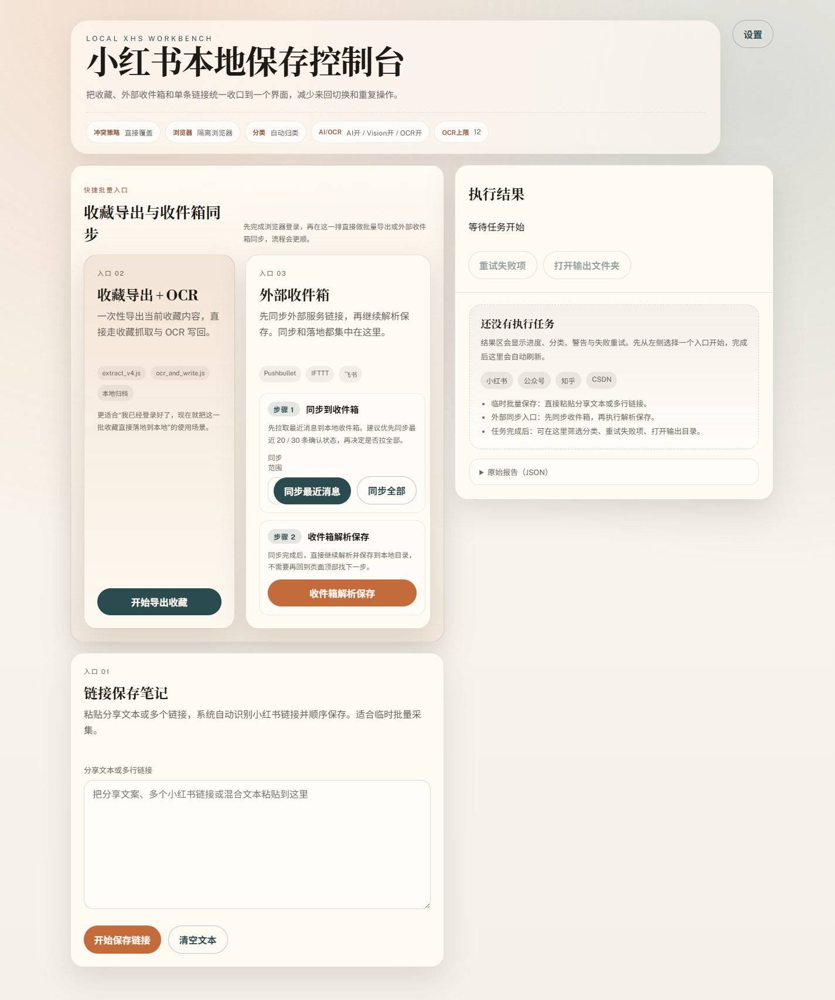
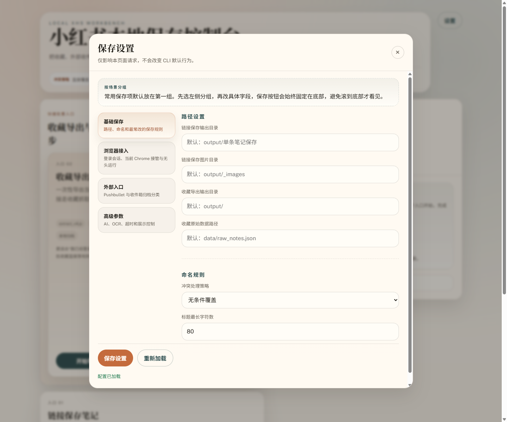
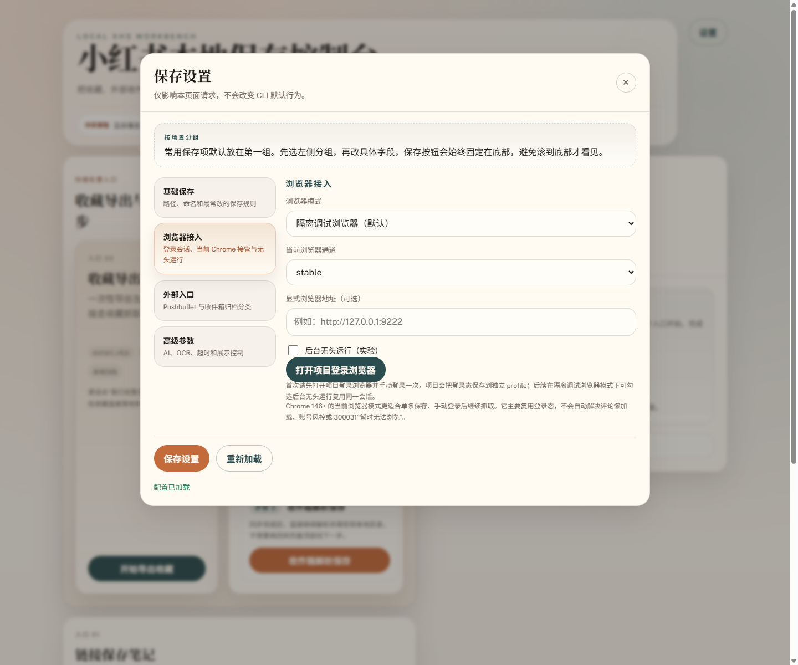
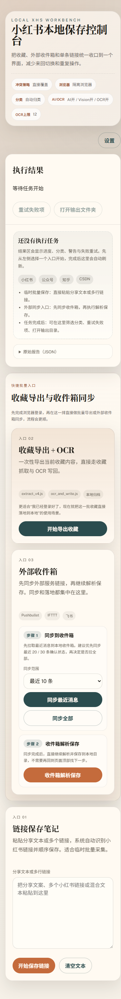
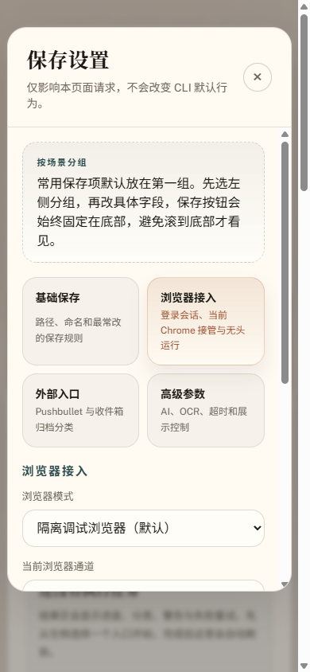

# 2026-03-24 设置弹层页签化审计

## 范围

本次审计只覆盖前端设置弹层的结构与可用性收口，不涉及抓取链路、登录态或保存结果逻辑。

审计重点：

- 设置弹层是否从长表单变成清晰分组
- 保存按钮是否不再被长内容埋没
- 移动端是否仍然可读、可点
- 改动是否通过自动化回归

## 环境

- 仓库：`G:\UserCode\XiaoHongshu_Collection`
- 审计地址：`http://127.0.0.1:3031/`
- 审计日期：`2026-03-24`
- 截图方式：Playwright
- 参考测试：`npm test`

## 自动化验证

```bash
npm test
```

结果：

- `352/352` 通过
- 未出现新的失败、跳过或 todo

## 截图清单

1. 桌面首页  
   

2. 桌面设置弹层  
   

3. 桌面浏览器页签  
   

4. 移动端首页  
   

5. 移动端设置弹层  
   

## 观察结论

### 1. 设置结构已明显收口

- 原本一屏拉到底的设置区，改成了 `基础保存 / 浏览器接入 / 外部入口 / 高级参数` 四组
- 高风险、低频项不再和常用路径设置混在一起
- 用户从首页进入设置后，能更快判断“我要改哪一组”

### 2. 保存动作已经收在稳定位置

- `保存设置` 与 `重新加载` 固定在底部区域
- 桌面端切换不同页签后，不需要再滚到底找主操作
- 这解决了“同步后没有保存按钮可见”的同类体验问题在设置区的复现风险

### 3. 移动端可用性比之前更好

- 页签在移动端折成 2 列，首屏即可看见全部分组
- 当前激活页签高亮足够明显
- 浏览器页签内容在移动端仍可单列阅读，没有出现横向溢出

## 剩余优化点

### P2：移动端页签副文案略密

- `浏览器接入` 和 `高级参数` 的副文案在 390 宽度下换行较多
- 下一轮可考虑让移动端页签只保留标题，把副文案挪成顶部说明或 tooltip 风格说明

### P2：设置弹层右侧内容仍然偏长

- 虽然已经按组拆分，但 `浏览器接入` 页签内的说明文案仍然偏长
- 下一轮可把说明压缩成一条摘要 + 一条“更多说明”提示，减轻视线负担

## 结论

这版已经达到“可交付的 UI 收口状态”：

- 结构更清晰
- 常用项更容易找到
- 底部操作更稳定
- 自动化测试和真实截图都支持这次改动

后续如继续优化，优先级建议是：

1. 缩短移动端页签副文案
2. 继续压缩浏览器页签说明文案
3. 视情况再做更细的键盘导航与焦点管理
