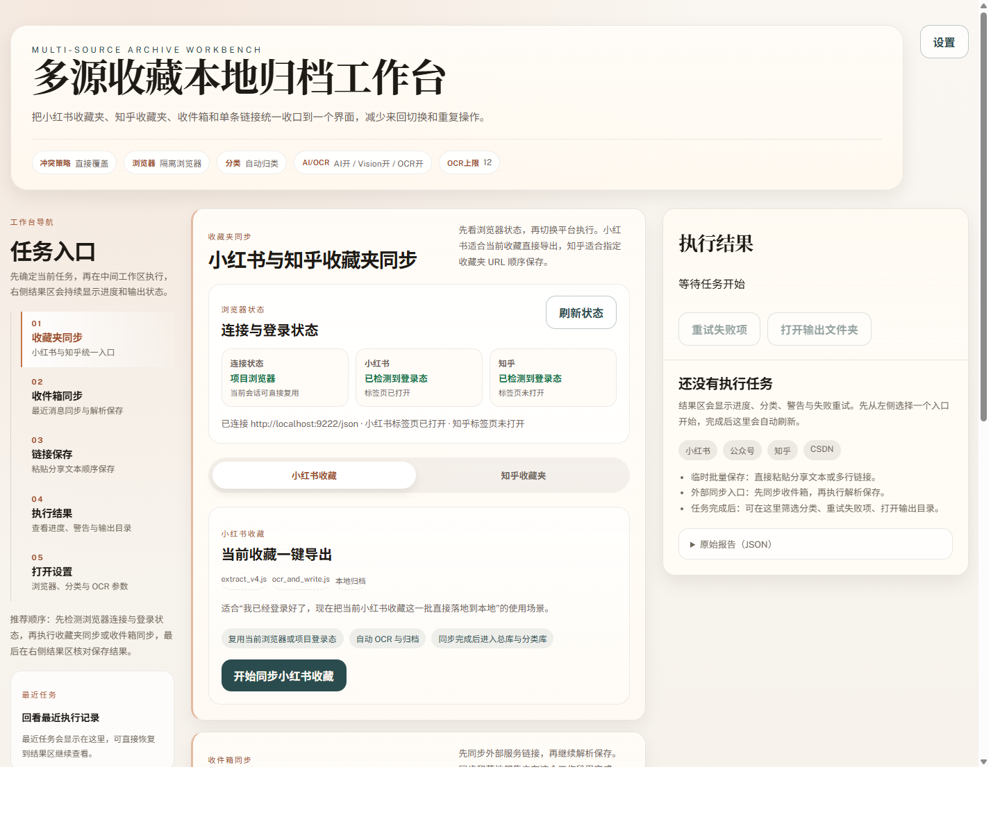
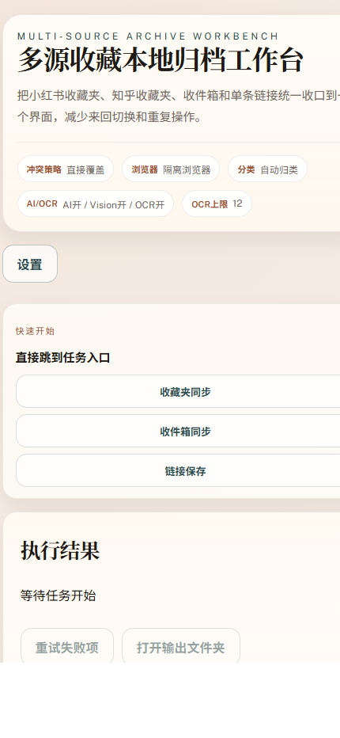

# 2026-03-26 UI 工作台截图审查

## 范围
- 审查对象：`http://127.0.0.1:3041` 的多源收藏本地归档工作台
- 启动方式：`$env:XHS_UI_PORT='3041'; node scripts/ui_server.js`
- 截图方式：Chrome 无头截图
- 说明：Playwright 在本机已打开 Chrome 会话下无法稳定拉起持久化上下文，本次改用 Chrome 原生无头截图保留证据

## 自动化验证
- 命令：`node --test scripts/ai/__tests__/ui_index.test.js scripts/ai/__tests__/ui_markup.test.js scripts/ai/__tests__/ui_server.test.js scripts/ai/__tests__/ui_collection_switch.test.js scripts/ai/__tests__/ui_task_history.test.js scripts/ai/__tests__/ui_browser_session.test.js`
- 结果：57/57 通过
- 命令：`npm test`
- 结果：368/368 通过

## 截图结论

### 桌面端首页

- 左侧任务入口、中间收藏夹工作区、右侧结果区的三栏关系已经清楚，页面不再像之前那样把入口堆成卡片墙。
- 浏览器状态区已经改成双层信息卡，能同时看见“连接状态 / 小红书 / 知乎”三块状态，不再只是平铺一句话。
- 最近任务卡片已经落在侧栏，和导航位置靠近，符合“回看刚执行过的结果”的心智路径。

### 移动端首页

- 这轮修正后，右上角的“设置”按钮不再挤出视口，窄屏下仍可直接点开。
- 现在在结果区之前增加了“快速开始”快捷入口，手机首屏可以直接跳到收藏夹同步、收件箱同步和链接保存，不需要先往下滚很久找入口。
- 标题、摘要标签和按钮尺寸在手机上仍可读，没有出现明显挤压或按钮断行。

## 本轮判断
- `P1` 已解决：收藏夹同步切换、浏览器状态提示、最近任务恢复、移动端快捷入口都已经落地，且测试通过。
- `P2` 可继续优化：移动端快捷入口现在是锚点跳转版，后续如果想更像 App，可以再加当前任务高亮或滚动过程中的激活态。
- `P2` 可继续优化：浏览器状态区现在是信息正确优先，后续可以再做更强的状态分层，比如“已连接但未登录”“已登录但目标标签页未打开”的视觉差异更明显一些。

## 关联文件
- `ui/app.js`
- `ui/styles.css`
- `ui/index.html`
